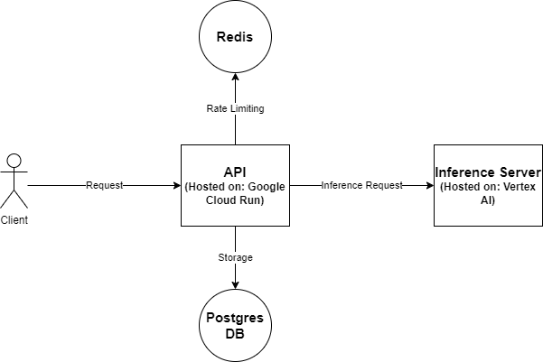

# API Framework design document

## Introduction
The API Framework is a set of APIs that provide access to Sunbird's machine learning models.

Current Models:
- Multi-lingual translation model
- Text-to-Speech model
- Speech-to-Text model

The framework should provide an intuitive way for developers to use the different models we have.

## Requirements
1. General requirements for all endpoints
   1. Structure should be intuitive.
   2. Validation
   3. Useful errors if anything goes wrong
2. Security/Authentication: 
   1. Users should be able to create accounts.
   2. Users should be able to get API keys which they'll need to access the accounts.
   3. API keys should last forever unless refreshed.
   4. Users should be able to refresh the API key.
   5. There should be an interface for users to create accounts and manage their API keys.
   6. Rate limiting (throttling).
3. Text Translation
   1. There should be an endpoint (or endpoints) for translation.
4. Text-to-Speech
   1. There should be an endpoint that receives text and returns an audio file. 
5. Speech-to-Text model
   1. Endpoint that receives audio data and transcribes it.
6. General endpoint?
   1. Endpoint that can take speech (or text) and return translated speech (or text).
   2. User can specify what they want.
7. Monitoring
   1. Admin should be able to track usage of the API (number of users/requests per user).
   2. Admin should be able to track latency of requests for each model.
8. Python package wrapper around the API (low priority)
   1. A python package that provides programmatic access to the API through python functions.

## Architecture

### Endpoint structure

#### Translation endpoints
Option 1:
```
/english-to-local
{
   "text": "",
   "target-language": ""
}

/local-to-english
{
   "text": ""
}
```

Option 2:
Endpoint: `/translate`

Request:
```
{
    "type": "english-to-local",
    "text": "",
    "target-language": ""
}
```

Option 3:

Endpoint `/translate`

Request:
```
{
   (optional) "source-language": ""
   "target-language": "",
   "text": "",
   (Optional, default: False) "return-confidences": False
}
```

Response for both options:
```
{
   "text": "",
   (optional) confidences: [1, 0.5, 0.67]
}
```

#### Text-to-speech
Endpoint: `/tts`.

Request:
```
{
   "text": "",
   (optional) "language": ""
}
```

Response (how to send/receive audio. File or audio stream):
```
{
   "audio": 
}
```

#### Speech-to-text
Endpoint: `/stt`

Request:
```
{
   "audio": "",
   "language": "",
   (Optional, default: False) "return-confidences": False
}
```

Response:
```
{
   "text": "",
   (optional) confidences: [1, 0.5, 0.67]
}
```

#### General endpoint
**TBD**


### Technologies
**API Framework**: [FastAPI](https://fastapi.tiangolo.com/)

**Authentication and User Management**: OAuth or  [AWS Cognito]()

**Model deployment**:
- HuggingFace
- AWS (Sagemaker)
- Google Cloud (Vertex.ai)


### Database structure


## Alternative solutions

## Testing

## Monitoring

## Alerting

## Tasks and scope
