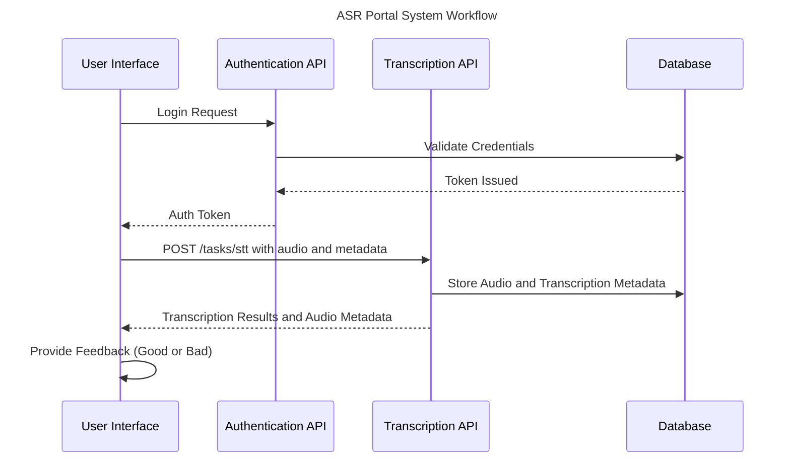

# Technical Design Document

## Purpose

This document defines the technical framework for the **ASR Portal React** project, focusing on design, architecture, implementation, and deployment. It ensures alignment among developers, stakeholders, and maintainers for the successful delivery of audio transcription features.

---

## Objectives

- **Accurate Transcription**: Develop a robust system for precise audio-to-text conversion.
- **User-Friendly Interface**: Simplify transcription workflows for users.
- **Integration**: Enable efficient communication between frontend and backend components.
- **Data Security**: Protect sensitive audio and transcription data.
- **Scalability**: Prepare for increasing usage and feature expansions.

---

## System Architecture

### Overview

The ASR Portal React system is designed as a modular, scalable solution with the following core components:

1. **Frontend**: React-based user interface for audio uploads and managing transcription outputs.
2. **Backend**: APIs handling authentication, audio processing, and transcription.
3. **Authentication**: Secure user access via JWT-based token mechanisms.
4. **Database**: For storing user data, audio files, and transcription results.

### Sequence Diagram

The interaction between components is outlined below:



---

## Core Components

1. **AudioInput**: Manages audio file uploads and validations (e.g., format, size).
2. **Auth (SignIn & SignUp)**: Handles user authentication flows.
3. **Transcription**: Interacts with APIs to process and display transcription results.
4. **Feedback**: Collects user feedback on whether the transcription was good or bad and communicates it back to the backend.
5. **Header & Footer**: Provides navigation and branding consistency.
6. **TranscriptionTextArea**: Editable text area for transcription review and modifications.

---

## API Endpoint: Speech-to-Text

### Endpoint

```http
POST /tasks/stt
```

### Description

Uploads an audio file and retrieves the transcription text of the audio.

### Parameters

#### Request Body

- **Content Type**: `multipart/form-data`
- **Fields**:
  - **audio** _(required)_: Binary string of the audio file.
  - **language** _(optional)_: String specifying the language of the audio.
  - **adapter** _(optional)_: String specifying the transcription adapter to use.
  - **recognise_speakers** _(optional)_: Boolean to enable or disable speaker diarization.
  - **whisper** _(optional)_: Boolean to use Whisper for transcription.

#### Example Request Body

```json
{
  "audio": "string($binary)",
  "language": "string",
  "adapter": "string",
  "recognise_speakers": true,
  "whisper": false
}
```

### Response

- **Content Type**: `application/json`
- **Fields**:
  - **audio_transcription**: String containing the transcription of the audio.
  - **diarization_output**: JSON object with detailed speaker diarization results.
  - **formatted_diarization_output**: String containing a formatted representation of the diarization output.
  - **audio_transcription_id**: Integer identifier for the transcription task.
  - **audio_url**: String containing the URL of the uploaded audio.
  - **language**: String indicating the language of the transcription.

#### Example Response

```json
{
  "audio_transcription": "string",
  "diarization_output": {},
  "formatted_diarization_output": "string",
  "audio_transcription_id": 0,
  "audio_url": "string",
  "language": "string"
}
```

---

## Implementation Plan

### Development Phases

1. **Setup Development Environment**:

   - Initialize the project using `create-react-app`.
   - Install dependencies and configure local environment settings.

2. **Authentication Module**:

   - Develop `SignIn` and `SignUp` components.
   - Integrate JWT-based token authentication.
   - Implement role-based access control for authorized features.

3. **Audio Upload**:

   - Build the `AudioInput` component for file validation and backend communication.
   - Ensure compatibility with common audio file formats.

4. **Transcription Workflow**:

   - Create the `Transcription` component for real-time status tracking.
   - Integrate the `/tasks/stt` endpoint for audio transcription.
   - Fetch transcription results via backend APIs.

5. **Feedback Collection**:

   - Implement the `Feedback` component to allow users to provide ratings (Good/Bad) for transcriptions.
   - Ensure the feedback is stored in the backend for quality improvements.

6. **UI/UX Enhancements**:

   - Standardize component styling using shared themes.
   - Ensure mobile responsiveness and accessibility compliance.

7. **Component Integration**:

   - Link individual components to form a seamless workflow.
   - Validate API integration across the frontend and backend.

8. **Testing**:

   - Write component tests and E2E tests using Cypress.

9. **Deployment**:
   - Finalize GitHub Pages configuration for production hosting.

---

## Deployment Strategy

### Hosting on GitHub Pages

1. Install required package:

   ```bash
   npm install gh-pages --save-dev
   ```

2. Add `homepage` and deployment scripts in `package.json`:

   ```json
   "homepage": "https://speech.sunbird.ai",
   "scripts": {
     "predeploy": "npm run build",
     "deploy": "gh-pages -d build"
   }
   ```

3. Deploy the app:

   ```bash
   npm run deploy
   ```

4. Access the application at `https://speech.sunbird.ai`.

---

## Testing Strategy

### Component and End-to-End (E2E) Testing

The testing strategy leverages **Cypress** for both **Component Testing** and **End-to-End (E2E) Testing**:

- **Component Testing**:

  - Validate individual React components, such as `AudioInput`, `Feedback`, and `TranscriptionTextArea`.
  - Ensure props, state management, and UI interactions behave as expected.

- **E2E Testing**:
  - Simulate complete workflows, including login, audio upload, transcription retrieval, and feedback submission.
  - Test edge cases like unsupported audio formats, large files, and server timeouts.

**Benefits**:

- Detect issues early in isolated components.
- Validate user workflows to ensure seamless functionality.

---

## Summary

This document provides a technical overview of the **ASR Portal React** project, ensuring clarity in system design, testing strategy, and deployment. By adhering to this structure, the project guarantees a robust, scalable, and user-centric transcription platform.
